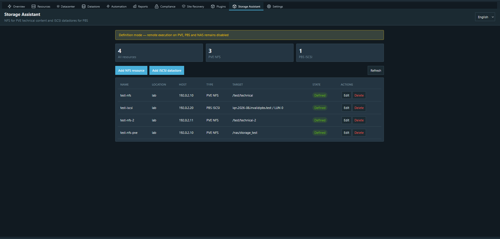
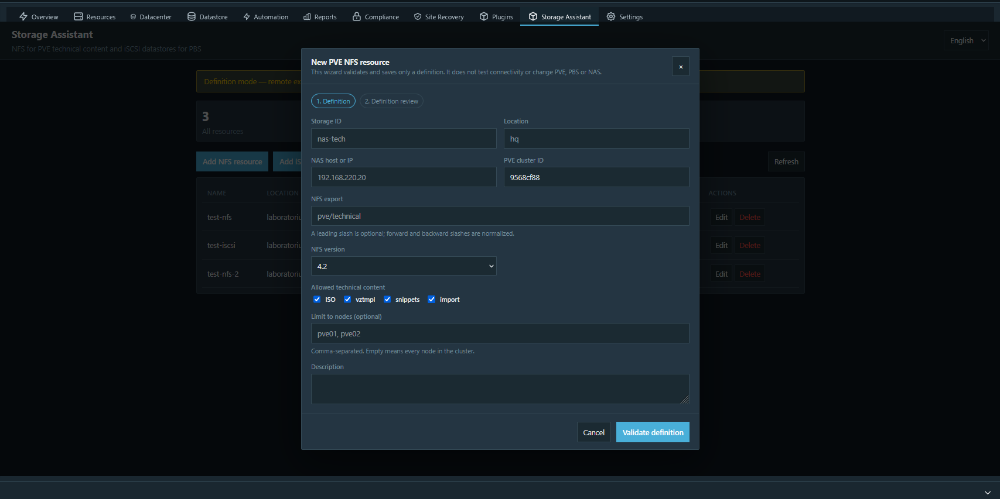
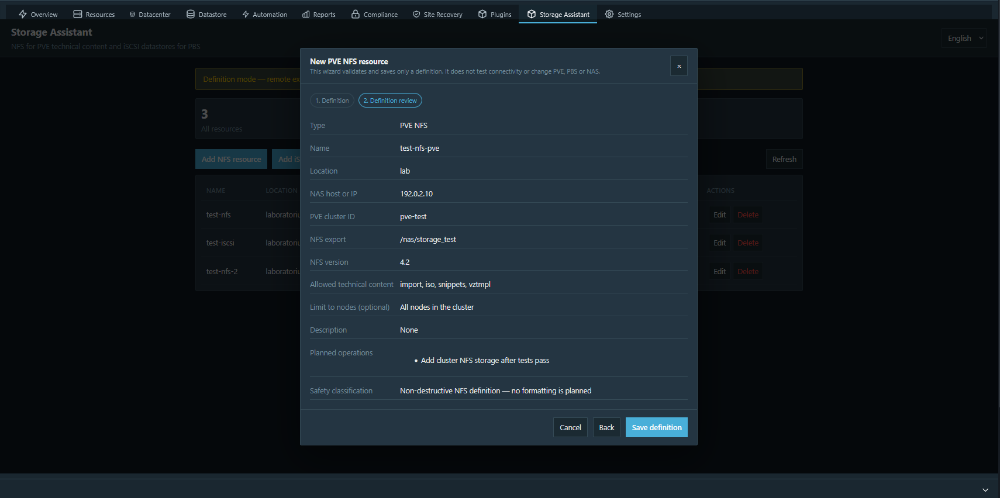
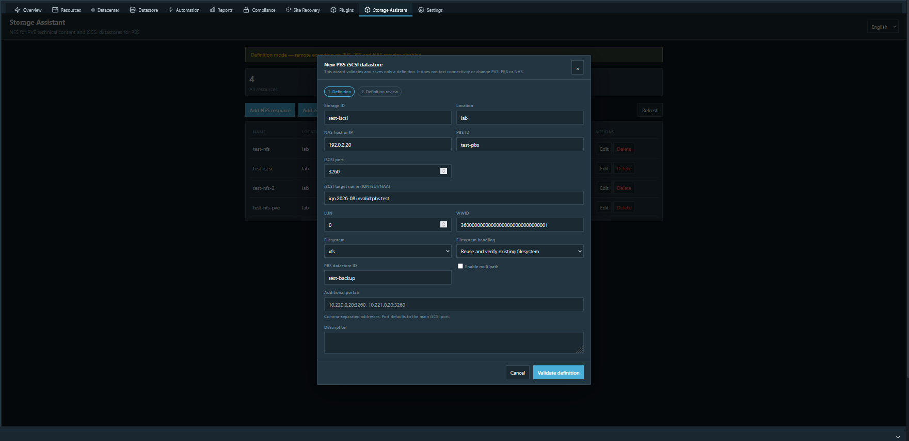
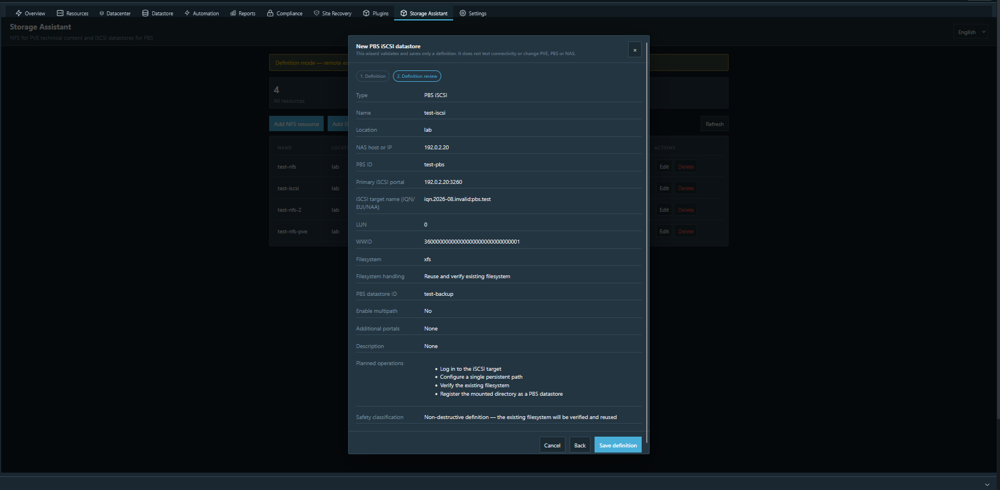
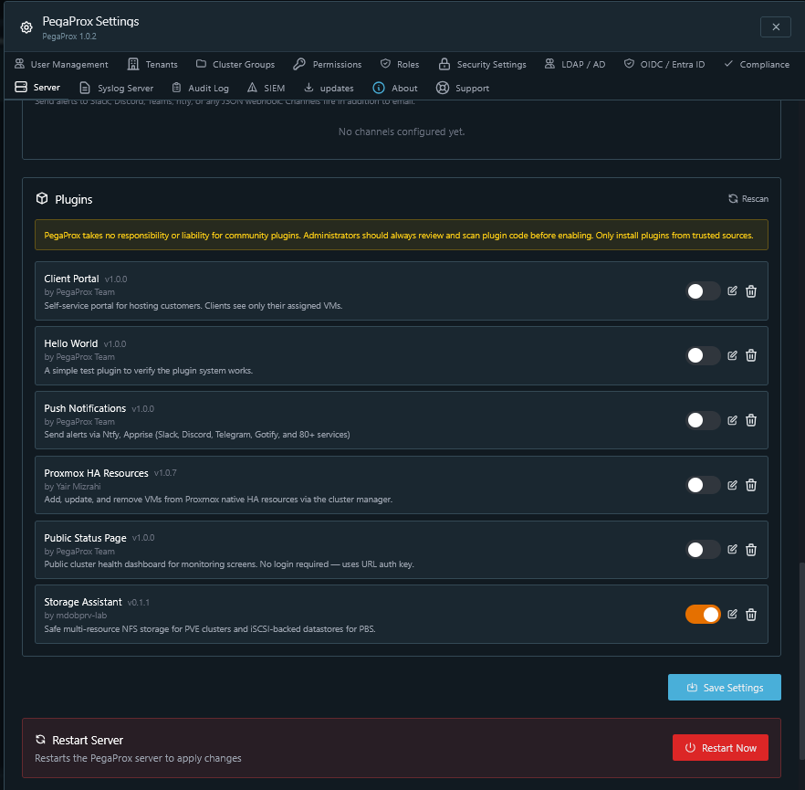

# PegaProx Storage Assistant

[](https://github.com/mdobprv-lab/pegaprox-storage-assistant/actions/workflows/ci.yml)

> [!IMPORTANT]
> **Early community preview.** Version 0.1.1 validates and stores storage
> definitions, but does not discover, connect, mount, format or register remote
> storage. Remote execution is deliberately disabled.

PegaProx 1.0.2+ plugin for two deliberately separated storage workflows:

- **PVE / NFS** — cluster-wide technical content (`iso`, `vztmpl`, `snippets`, `import`), never VM disks or backups.
- **PBS / iSCSI** — a dedicated LUN attached to one PBS, formatted as XFS/ext4 and registered as a PBS datastore.

The registry supports multiple NAS devices, exports, targets, LUNs and network
locations. Distinct portals exposing the same WWID will be treated as paths to one
LUN in the execution milestone.

## Design boundaries

| Managed system | Protocol | Intended role | Explicitly excluded |
|---|---|---|---|
| PVE cluster | NFS | Shared technical content: `iso`, `vztmpl`, `snippets`, `import` | VM disks and backups |
| PBS server | iSCSI | Dedicated LUN formatted with XFS/ext4 and registered as one PBS datastore | Attaching the same LUN to PVE or another PBS |

The separation is intentional. PVE receives cluster-wide NFS storage for technical
content, while PBS receives a block device with one unambiguous owner. The plugin is
NAS-vendor-neutral and is designed to manage definitions from multiple NAS devices
and network locations.

## Current milestone: 0.1.1 community preview

This foundation release provides:

- PegaProx manifest, backend registration and embedded plugin page;
- English and Polish UI catalogs with per-key English fallback;
- Modern, Corporate Dark/Light and Cloud Dark/Light presentation modes;
- plugin-wide language and theme defaults through PegaProx's `config.json` editor;
- two-step NFS and iSCSI definition wizards with review pages;
- complete safety review of every destination-critical NFS and iSCSI field;
- user-friendly NFS export input normalized to one absolute POSIX path;
- persistent, cross-process locked multi-resource registry;
- separate create/update operations with stale-ID and resource-type overwrite protection;
- strict resource validation and a read-only deployment-plan endpoint;
- hard allowlist for PVE technical content;
- WWID/LUN/datastore/export ownership collision prevention;
- RBAC and PegaProx audit logging for definition changes;
- no remote mutation yet (`execution_enabled: false`).

### Compatibility and validation

- tested with PegaProx 1.0.2 in the official Docker deployment model;
- tested on Python 3.12;
- verified in Modern, Corporate Dark/Light and Cloud Dark/Light layouts;
- English and Polish interface catalogs with matching keys;
- 29 automated tests covering validation, persistence, concurrency, authorization
  and frontend contracts;
- CI validates Python, JSON, shell scripts, embedded JavaScript and the complete
  unit-test suite.

Real NAS, PVE and PBS discovery tests are intentionally deferred to milestones 2–3.

## Screenshots

All storage definitions shown below are synthetic examples. Host addresses use the
RFC 5737 documentation range `192.0.2.0/24`; the IQN, WWID and datastore names do
not identify real infrastructure. The `10.220.0.20` and `10.221.0.20` portal
addresses visible in the empty iSCSI form are static UI placeholders. They are not
stored unless an operator explicitly enters them.

### Resource overview



### PVE/NFS wizard





### PBS/iSCSI wizard





<details>
<summary>Plugin activation in PegaProx 1.0.2</summary>



</details>

API base: `/api/plugins/storage-assistant/api`

| Route | Methods | Purpose |
|---|---|---|
| `ui` | GET | Plugin page |
| `locale?lang=en|pl` | GET | Translation catalog |
| `settings` | GET | Sanitized, non-sensitive UI defaults |
| `status` | GET | Plugin and registry summary |
| `resources` | GET, POST, PUT, DELETE | List, create, update or delete validated definitions |
| `plan` | POST | Generate a non-executing deployment plan |

The generic PegaProx plugin editor exposes `config.json`. Storage Assistant accepts only:

```json
{
  "default_language": "auto",
  "theme_override": "auto"
}
```

`default_language` accepts `auto`, `en` or `pl`. `theme_override` accepts `auto`,
`modern-dark`, `corporate-dark`, `corporate-light`, `cloud-dark` or `cloud-light`.
Unknown values and keys are ignored by the runtime API. Remote execution cannot be
enabled through this file.

In version 0.1.1, **Validate definition** checks syntax, normalization, ownership
collisions and safety classification only. It does not probe NAS, PVE or PBS.
NFS/iSCSI discovery and connectivity diagnostics belong to roadmap milestones 2–3.

## Feedback requested

This preview is published early to validate integration decisions before the remote
execution layer is implemented. Feedback from PegaProx maintainers and operators is
especially useful in these areas:

- reusing PegaProx-managed PVE/PBS connections without duplicating credentials;
- the preferred background-task, progress-reporting and cancellation interfaces;
- canonical RBAC and audit integration for plugin-initiated host operations;
- targeting one PVE node, an entire PVE cluster or one PBS instance;
- the supported frontend navigation model for global and PBS-oriented plugins;
- expectations for community-plugin packaging and marketplace readiness.

Please treat the current API and data schema as preview interfaces until the first
execution-capable release.

## Roadmap

1. Resource registry and i18n foundation.
2. PVE/NFS discovery, cluster reachability checks and wizard.
3. PBS/iSCSI discovery, WWID/multipath safety checks and wizard.
4. Explicit apply/verify/rollback task engine and audit log.
5. Health monitoring and diagnostic reports.

## Development

```bash
python -m unittest discover -s tests -v
```

Do not clone the repository directly under `plugins/`: the repository name and runtime plugin ID intentionally differ. Use the installer so the runtime directory is exactly `plugins/storage-assistant`:

```bash
sudo ./install.sh
# official Docker container, executed inside the container:
PEGAPROX_DIR=/app ./install.sh
```

Rescan plugins and enable **Storage Assistant** in PegaProx settings. Runtime definitions are saved under `config/storage-assistant/resources.json`, not inside the replaceable plugin directory.

Installing into a running Docker container survives a restart but not replacement of
that container. Re-run the installer after recreation, or package/mount
`plugins/storage-assistant` as part of the container deployment. The registry remains
persistent when `/app/config` uses the standard PegaProx volume.

### PegaProx 1.0.2 navigation limitation

Cloud exposes plugin frontends from its global **Plugins** page. Modern and Corporate
insert frontend tabs only into a selected PVE cluster view. PegaProx 1.0.2 does not
provide the same extension point in the PBS view, so use the Storage Assistant tab
from any PVE cluster or open `/api/plugins/storage-assistant/api/ui` directly. This is
a PegaProx navigation limitation; the plugin backend and PBS definitions are global.

## Safety model

One LUN has one role and one PBS owner. Formatting will never be inferred from a device path; later execution code will require target IQN, LUN, WWID, size, signatures and an explicit typed confirmation. Real access separation remains the NAS administrator's responsibility through initiator IQN ACLs, CHAP and network segmentation.
